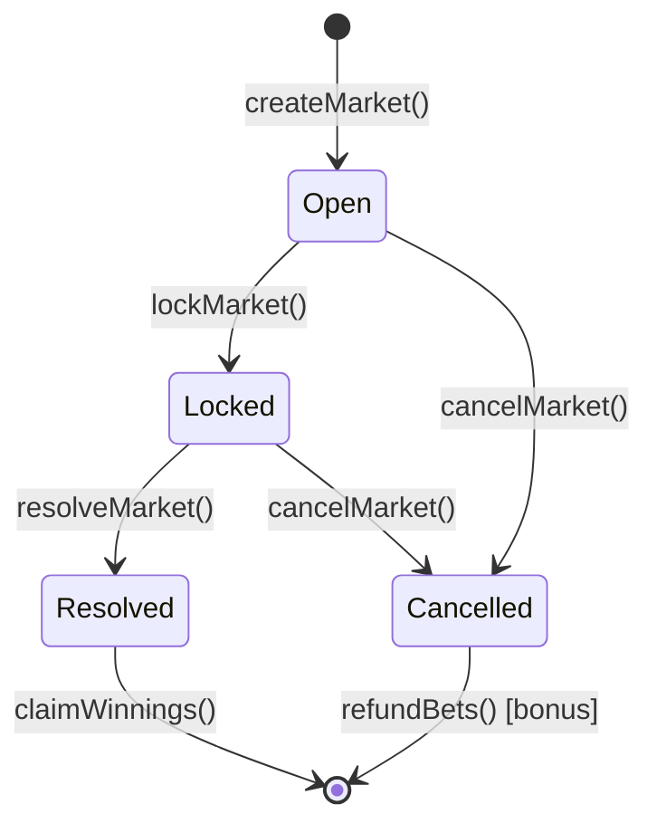

# Market Lifecycle

## State Diagram



## Timeline

```
creation          lockTime              resolveTime
   |                 |                      |
   |--- Open --------|--- Locked -----------|
   |   (betting)     |   (no bets)          | resolve allowed
```

## Per-State Rules

### Open
- Bettors call `placeBet()`
- Requires `block.timestamp < lockTime`
- Pools accumulate per outcome

### Locked
- No new bets accepted
- Resolver triggered after `lockTime`
- Waiting for match completion

### Resolved
- `winningOutcome` is set
- Winners call `claimWinnings()`
- Protocol fee sent to Treasury

### Cancelled
- Market voided before resolution
- Refunds expected (bonus implementation)

## Resolver Responsibilities

1. Call `lockMarket()` at or after kickoff
2. Call `resolveMarket(outcome)` after final result
3. Optionally `cancelMarket()` for postponed events
